# HW1- Auto MPG Dataset Analysis

<h4>Load the Auto MPG dataset from https://archive.ics.uci.edu/ml/datasets/Auto+MPG </h4>


```python
# import the required libraries 
import pandas as pd
from statistics import mean 
import numpy as np 

# read the csv data from local drive 
data = pd.read_csv("auto-mpg.csv")
print(data.shape)
data.head(5)
```

    (398, 9)
    


<div>
<style scoped>
    .dataframe tbody tr th:only-of-type {
        vertical-align: middle;
    }

    .dataframe tbody tr th {
        vertical-align: top;
    }

    .dataframe thead th {
        text-align: right;
    }
</style>
<table border="1" class="dataframe">
  <thead>
    <tr style="text-align: right;">
      <th></th>
      <th>mpg</th>
      <th>cylinders</th>
      <th>displacement</th>
      <th>horsepower</th>
      <th>weight</th>
      <th>acceleration</th>
      <th>model_year</th>
      <th>origin</th>
      <th>car_name</th>
    </tr>
  </thead>
  <tbody>
    <tr>
      <th>0</th>
      <td>18.0</td>
      <td>8.0</td>
      <td>307.0</td>
      <td>130.0</td>
      <td>3504.0</td>
      <td>12.0</td>
      <td>70.0</td>
      <td>1.0</td>
      <td>chevrolet chevelle malibu</td>
    </tr>
    <tr>
      <th>1</th>
      <td>15.0</td>
      <td>8.0</td>
      <td>350.0</td>
      <td>165.0</td>
      <td>3693.0</td>
      <td>11.5</td>
      <td>70.0</td>
      <td>1.0</td>
      <td>buick skylark 320</td>
    </tr>
    <tr>
      <th>2</th>
      <td>18.0</td>
      <td>8.0</td>
      <td>318.0</td>
      <td>150.0</td>
      <td>3436.0</td>
      <td>11.0</td>
      <td>70.0</td>
      <td>1.0</td>
      <td>plymouth satellite</td>
    </tr>
    <tr>
      <th>3</th>
      <td>16.0</td>
      <td>8.0</td>
      <td>304.0</td>
      <td>150.0</td>
      <td>3433.0</td>
      <td>12.0</td>
      <td>70.0</td>
      <td>1.0</td>
      <td>amc rebel sst</td>
    </tr>
    <tr>
      <th>4</th>
      <td>17.0</td>
      <td>8.0</td>
      <td>302.0</td>
      <td>140.0</td>
      <td>3449.0</td>
      <td>10.5</td>
      <td>70.0</td>
      <td>1.0</td>
      <td>ford torino</td>
    </tr>
  </tbody>
</table>
</div>


<h4>Calculate min, max, mean, and standard deviation for four attributes</h4>


```python
# Calculate the Min for MPG, displacement, horsepower and weight respectively. 

min1 = min(data["mpg"])
min2 = min(data["displacement"])
min3 = np.nanmin(data["horsepower"]) # skip the NAN value and calculate the min
min4 = min(data["weight"])

print("Min of mpg is:", min1)
print("Min of displacementis is:", min2)
print("Min of horsepower is:", min3)
print("Min of weight is:", min4)  
```

    Min of mpg is: 9.0
    Min of displacementis is: 68.0
    Min of horsepower is: 46.0
    Min of weight is: 1613.0
    


```python
# Calculate the Max for MPG, displacement, horsepower and weight respectively. 

max1 = max(data["mpg"])
max2 = max(data["displacement"])
max3 = np.nanmax(data["horsepower"])
max4 = max(data["weight"])

print("Max of mpg is:", max1)
print("Max of displacementis is:", max2)
print("Max of horsepower is:", max3)
print("Max of weight is:", max4) 
```

    Max of mpg is: 46.6
    Max of displacementis is: 455.0
    Max of horsepower is: 230.0
    Max of weight is: 5140.0
    


```python
# Calculate the mean for MPG, displacement, horsepower and weight respectively. 

m1 = mean(data["mpg"])
m2 = mean(data["displacement"])
m3 = np.nanmean(data["horsepower"])
m4 = mean(data["weight"])

print("Mean of mpg is:", m1)
print("Mean of displacementis is:", m2)
print("Mean of horsepower is:", m3)
print("Mean of weight is:", m4) 
```

    Mean of mpg is: 23.514572864321607
    Mean of displacementis is: 193.42587939698493
    Mean of horsepower is: 104.46938775510205
    Mean of weight is: 2970.424623115578
    


```python
# Calculate the standard deviation for MPG, displacement, horsepower and weight respectively. 

s1 = np.std(data["mpg"])
s2 = np.std(data["displacement"])
s3 = np.std(data["horsepower"])
s4 = np.std(data["weight"])

print("Standard deviation of mpg is:", s1)
print("Standard deviation of displacementis is:", s2)
print("Standard deviation of horsepower is:", s3)
print("Standard deviation of weight is:", s4) 
```

    Standard deviation of mpg is: 7.806159061274433
    Standard deviation of displacementis is: 104.13876352708563
    Standard deviation of horsepower is: 38.442032714425984
    Standard deviation of weight is: 845.7772335198177
    

<h4>Create histograms for the MPG, acceleration, horsepower and weight of 4, 6 and 8 cylinder cars</h4>


```python
from matplotlib import pyplot as plt

# Select the data from 4, 6 and 8 cylinder cars
c4 = data[data["cylinders"] == 4]
c6 = data[data["cylinders"] == 6]
c8 = data[data["cylinders"] == 8] 
```


```python
# Create histogram for mpg of 4 cylinder cars
y = c4["mpg"]

# Create the plot 
plt.hist(y) 

# Add title and axis names
plt.title('4 Cylinder Cars')
plt.xlabel('MPG')
plt.ylabel('Frequency')

# Show the plot 
plt.show()
```


    

    


```python
# Create histogram for 4 attributes of 4, 6 and 8 cylinder cars

attribute = ["mpg", "acceleration", "horsepower", "weight"]
cylinder = [c4, c6, c8]
titles = ['4 Cylinder Cars', '6 Cylinder Cars', '8 Cylinder Cars']


for i in attribute: 
    for j, k in zip(cylinder, range(3)): 

            y = j[i]
        
            # Create the plot 
            plt.hist(y) 

            # Add title and axis names
            plt.title(titles[k]) 
            plt.xlabel(i)
            plt.ylabel('Frequency')

            # Show the plot 
            plt.show()

```


    
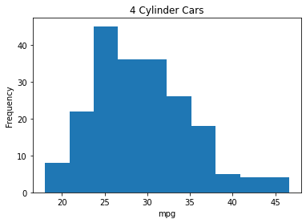
    


    
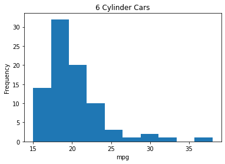
    


    
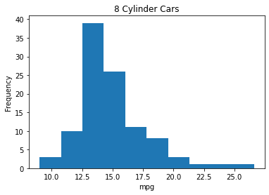
    


    
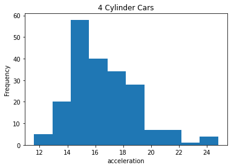
    


    
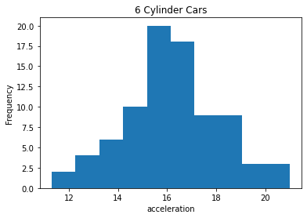
    


    
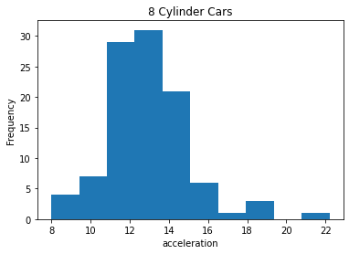
    


    
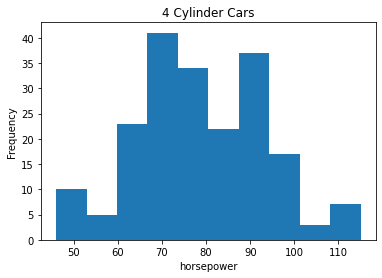
    


    
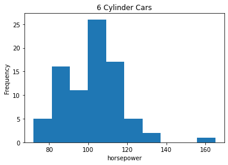
    


    
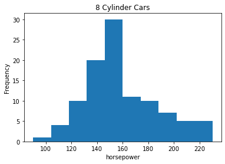
    


    
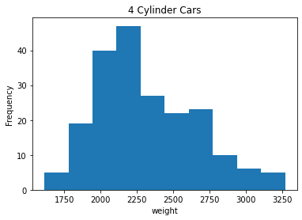
    


    
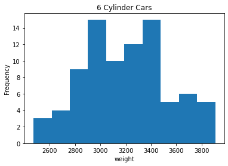
    


    
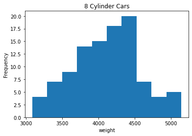
    


```python

```
